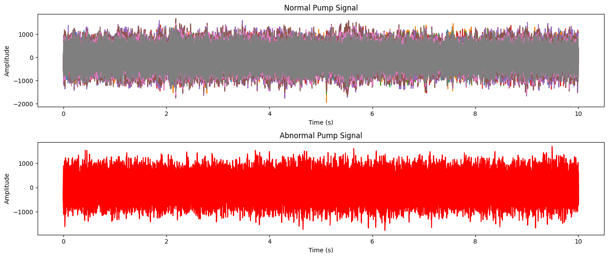
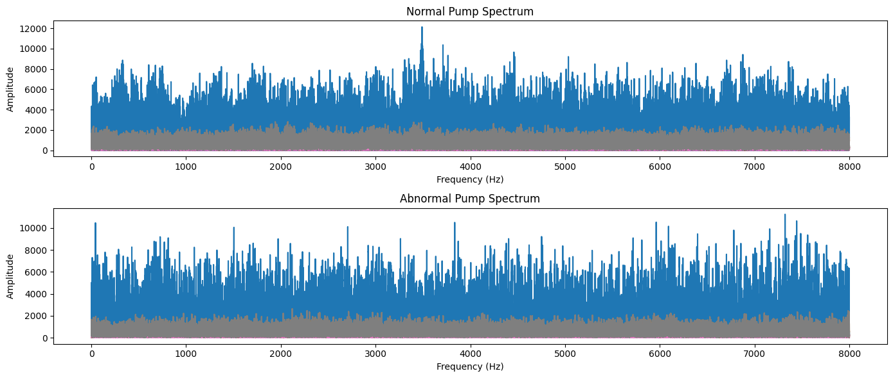
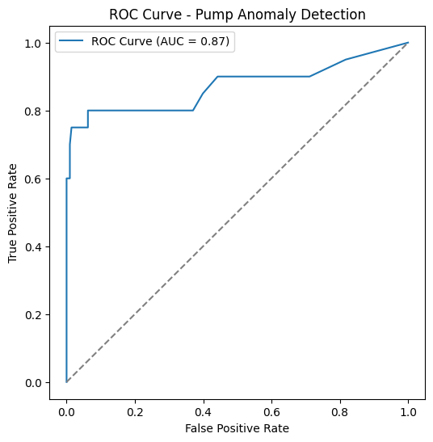
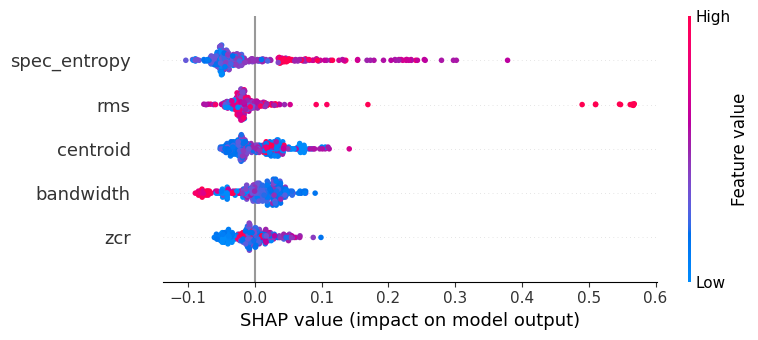
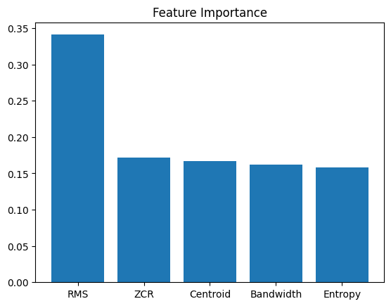
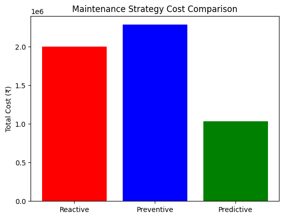
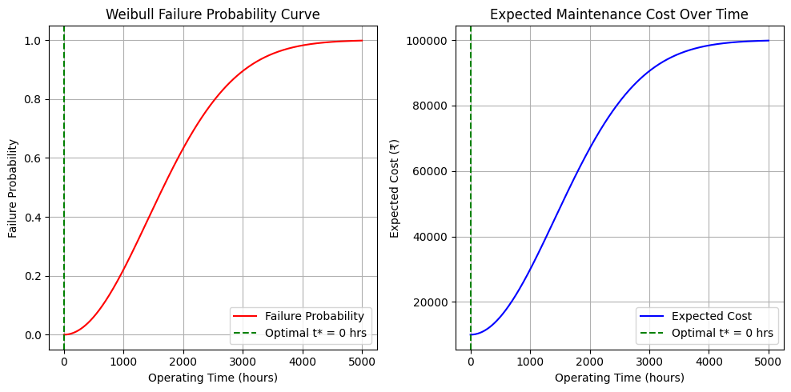

# Pump Predictive Maintenance using Machine Learning

## Overview
This project develops a predictive maintenance system for industrial pumps using acoustic and vibration signal analysis.

The system detects abnormal pump behavior using machine learning and explainable AI techniques.

---

## Features Used
- RMS
- Zero Crossing Rate (ZCR)
- Spectral Entropy
- Spectral Centroid
- Spectral Bandwidth

---

## Machine Learning Techniques
- Random Forest Classifier
- SMOTE
- SHAP Explainability

---

## Model Evaluation
- Accuracy: 88.9%
- Recall: 61%
- F1-score: 0.50

---

## Business Extension
- Cost optimization
- Threshold optimization
- Predictive maintenance analytics

---

## Future Improvements
- Power BI dashboard
- Real-time monitoring
- Embedded deployment

---

## Dataset

The project uses acoustic and vibration signal data of industrial pumps.

- Normal pump signals
- Abnormal pump signals

Signals were processed at 16 kHz sampling rate for feature extraction and anomaly detection.

---

## Tech Stack

- Python
- NumPy
- Pandas
- Scikit-learn
- SciPy
- Librosa
- Matplotlib
- SHAP
- SMOTE
- Jupyter Notebook

---

## Project Structure

```text
Pump-predictive-maintenance-ML/
│
├── pump_fault_detection.ipynb
├── README.md
├── results/
│   ├── time_vs_amplitude_signal.png
│   ├── frequency_spectrum.png
│   ├── roc_curve.png
│   ├── shap_value.png
│   ├── feature_importance.png
│   ├── maintenance_cost_comparison.png
│   └── weibull_curve.png
```

---

## Key Learnings

- Signal processing for industrial systems
- Feature extraction from vibration data
- Explainable AI using SHAP
- Handling imbalanced datasets using SMOTE
- Predictive maintenance cost optimization
- Reliability analysis using Weibull distribution

---

# Results Visualization

## Time Domain Signal


## Frequency Spectrum


## ROC Curve


## SHAP Explainability


## Feature Importance


## Maintenance Cost Comparison


## Weibull Failure Probability

